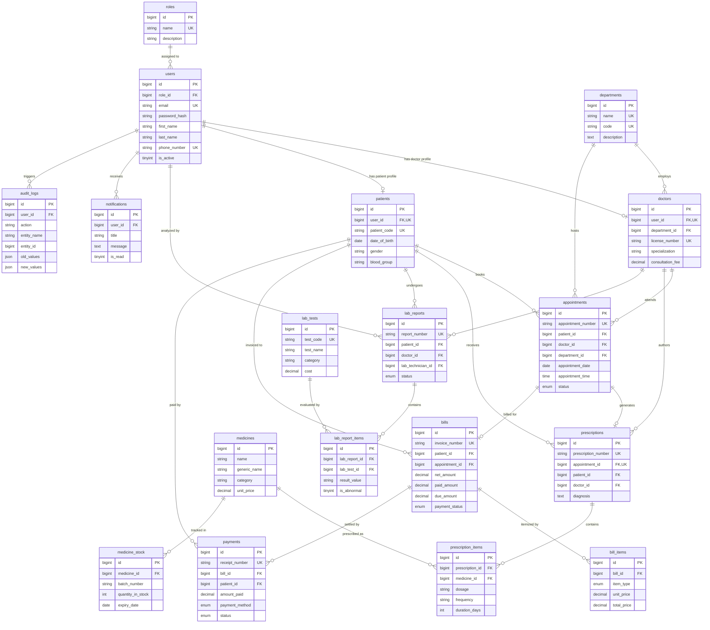

# Smart Hospital Management System - Database Design Specification (MySQL 8 - 3NF)

**Author:** Senior Database Architect  
**Database Engine:** MySQL 8.0+ (InnoDB Engine)  
**Normalization Level:** Third Normal Form (3NF)  
**Character Set:** `utf8mb4_unicode_ci`  

---

## 1. Overview & Architectural Principles

This database architecture is engineered for enterprise-grade performance, strict transactional integrity, and compliance with healthcare data management standards (e.g., HIPAA audit trail readiness).

### Key Design Highlights:
1. **Third Normal Form (3NF) Compliance**: All non-key attributes are fully dependent ONLY on the primary key, eliminating data redundancy and update anomalies.
2. **Surrogate Primary Keys**: All tables use `BIGINT UNSIGNED AUTO_INCREMENT PRIMARY KEY` for consistent join performance and index efficiency.
3. **Referential Integrity**: Every relationship is enforced using foreign keys (`CONSTRAINT fk_...`) with explicit `ON DELETE` and `ON UPDATE` rules (`CASCADE`, `RESTRICT`, `SET NULL`).
4. **Optimized Indexing**: Composite and single-column indexes on high-frequency lookup fields (`email`, `patient_code`, `appointment_number`, `invoice_number`, foreign keys, date ranges, and status flags).
5. **Auditing & Timestamps**: Every table contains standardized `created_at` and `updated_at` timestamps for temporal tracking.
6. **Financial Data Integrity**: Monetary values use fixed-point `DECIMAL(10, 2)` to eliminate floating-point rounding errors.

---

## 2. Entity-Relationship (ER) Diagram

---

## 3. Detailed Relationship Explanations

| Parent Entity | Child Entity | Cardinality | Relationship Nature | Cascade Behavior (Delete / Update) |
|---|---|---|---|---|
| `roles` | `users` | 1 to Many (`1:N`) | Each user must belong to exactly 1 role. A role can be assigned to multiple users. | `ON DELETE RESTRICT` / `ON UPDATE CASCADE` |
| `users` | `doctors` | 1 to 1 (`1:1`) | A doctor profile extends a user account. Deleting a user deletes their doctor record. | `ON DELETE CASCADE` / `ON UPDATE CASCADE` |
| `users` | `patients` | 1 to 0/1 (`1:1`) | Optional link; walk-in patients may not have a web login account. | `ON DELETE SET NULL` / `ON UPDATE CASCADE` |
| `departments` | `doctors` | 1 to Many (`1:N`) | Doctors are assigned to 1 clinical department. Cannot delete a department if active doctors exist. | `ON DELETE RESTRICT` / `ON UPDATE CASCADE` |
| `patients` | `appointments` | 1 to Many (`1:N`) | Patients can book multiple appointments over time. | `ON DELETE RESTRICT` / `ON UPDATE CASCADE` |
| `doctors` | `appointments` | 1 to Many (`1:N`) | Doctors conduct multiple scheduled appointments. | `ON DELETE RESTRICT` / `ON UPDATE CASCADE` |
| `appointments` | `prescriptions` | 1 to 1 (`1:1`) | An appointment yields at most 1 unique medical prescription. | `ON DELETE RESTRICT` / `ON UPDATE CASCADE` |
| `prescriptions` | `prescription_items` | 1 to Many (`1:N`) | Composite child table. Deleting a prescription automatically removes line items. | `ON DELETE CASCADE` / `ON UPDATE CASCADE` |
| `medicines` | `prescription_items` | 1 to Many (`1:N`) | Master drug referenced across prescription lines. | `ON DELETE RESTRICT` / `ON UPDATE CASCADE` |
| `medicines` | `medicine_stock` | 1 to Many (`1:N`) | One drug can have multiple inventory batches with distinct expiry dates. | `ON DELETE CASCADE` / `ON UPDATE CASCADE` |
| `lab_reports` | `lab_report_items` | 1 to Many (`1:N`) | Composite child table containing specific laboratory test measurements. | `ON DELETE CASCADE` / `ON UPDATE CASCADE` |
| `bills` | `bill_items` | 1 to Many (`1:N`) | Line items constituting an invoice total. Deleting an invoice removes its items. | `ON DELETE CASCADE` / `ON UPDATE CASCADE` |
| `bills` | `payments` | 1 to Many (`1:N`) | One bill can be settled via multiple partial payments. | `ON DELETE RESTRICT` / `ON UPDATE CASCADE` |

---

## 4. Module & Table Rationale (3NF Decomposition)

### **Authentication Module**
1. **`roles`**: Stores distinct application roles (`ADMIN`, `DOCTOR`, `PATIENT`, etc.). Normalizing roles into a separate entity avoids repeating role strings and enables dynamic permissions.
2. **`users`**: Central account table holding authentication credentials (`email`, `password_hash`). Encapsulating account credentials separately from clinical profiles enforces **1NF/2NF/3NF** and prevents duplicating authentication columns in doctors and patients tables.

### **Hospital Core Module**
3. **`departments`**: Maintains hospital clinical units (`Cardiology`, `Neurology`). Storing department attributes centrally avoids multi-column transitive dependencies inside the `doctors` table.
4. **`doctors`**: Contains medical practitioner specific data (`license_number`, `specialization`, `consultation_fee`). Linked via a strict 1-to-1 foreign key to `users.id`.
5. **`patients`**: Holds patient demographics (`patient_code`, `date_of_birth`, `blood_group`, `emergency_contact`). Linked 1-to-1 optionally to `users.id`.

### **Appointments Module**
6. **`appointments`**: Manages appointment bookings, time slots, and status (`SCHEDULED`, `CONFIRMED`, `COMPLETED`, `CANCELLED`). Resolves the Many-to-Many relationship between `patients` and `doctors`.

### **Prescriptions & Pharmacy Module**
7. **`medicines`**: Drug catalog (`name`, `generic_name`, `category`, `unit_price`). Separates static drug definition from stock batches.
8. **`medicine_stock`**: Inventory tracking per batch (`batch_number`, `quantity_in_stock`, `expiry_date`). Separating stock into a distinct entity satisfies **3NF** since expiration and quantity depend on batch instances, not drug definitions.
9. **`prescriptions`**: Prescription header generated during consultation (`diagnosis`, `doctor_notes`). Linked 1-to-1 with `appointments`.
10. **`prescription_items`**: Line items detailing drug, dosage, frequency, and duration. Resolves Many-to-Many between `prescriptions` and `medicines`.

### **Laboratory Module**
11. **`lab_tests`**: Master catalog of lab tests (`test_code`, `test_name`, `cost`, `normal_range`).
12. **`lab_reports`**: Lab requisition header tracking ordering doctor, technician, patient, and sample timestamps.
13. **`lab_report_items`**: Individual test values and abnormality flags for a lab report. Resolves Many-to-Many between `lab_reports` and `lab_tests`.

### **Billing & Payments Module**
14. **`bills`**: Master invoice tracking gross amount, discounts, taxes, net payable, and payment status (`UNPAID`, `PARTIALLY_PAID`, `PAID`).
15. **`bill_items`**: Itemized charges (`CONSULTATION`, `MEDICINE`, `LAB_TEST`, `ROOM_CHARGE`). Captures point-in-time pricing to preserve audit integrity even if master catalog prices change later.
16. **`payments`**: Payment transaction receipts (`CASH`, `CREDIT_CARD`, `UPI`, `INSURANCE`). Allows tracking partial and split payments per bill.

### **System Modules**
17. **`notifications`**: Targeted user alerts (`APPOINTMENT_REMINDER`, `LAB_RESULT_READY`, `BILL_DUE`) with read receipts.
18. **`audit_logs`**: Immutable security log tracking system events, IP addresses, entity mutations, and `JSON` payload diffs (`old_values`, `new_values`).

---

## 5. File References

- Master SQL Schema File: [schema.sql](file:///c:/Users/ARYAN%20RAI/OneDrive/Desktop/Hospital-Management-System/databases/schema.sql)
- Sample Seed Data File: [sample_data.sql](file:///c:/Users/ARYAN%20RAI/OneDrive/Desktop/Hospital-Management-System/databases/sample_data.sql)
